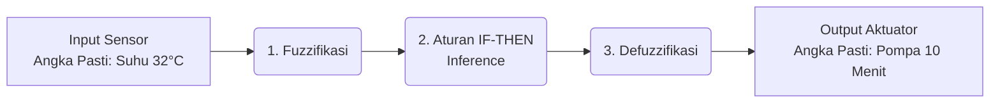

# Pengenalan Logika Fuzzy (Fuzzy Logic)

Logika Fuzzy adalah cara membuat komputer berpikir "seperti manusia". Komputer tradisional hanya mengenal hitam dan putih (Benar/Salah, 1/0, Nyala/Mati). Sebaliknya, manusia berpikir dengan nuansa abu-abu ("agak panas", "sedikit basah", "sangat kering"). Logika fuzzy memungkinkan komputer untuk memproses "nuansa" atau derajat kebenaran ini.

## 1. Perbedaan Logika Tradisional vs Fuzzy

### Logika Tradisional (Crisp Logic)
Sama seperti kode kita saat ini:
* Jika Suhu > 30°C ➔ Pemanas MATI
* Jika Suhu ≤ 30°C ➔ Pemanas MENYALA

> Masalahnya: Bagaimana jika suhunya 30.1°C? Komputer akan langsung mematikan pemanas. Jika suhunya turun sedikit jadi 29.9°C, komputer langsung menyalakan pemanas. Ini membuat alat cepat rusak karena terus menerus mati-nyala (*flickering*).

### Logika Fuzzy
* Suhu 32°C = "Panas" (Derajat 0.8) dan "Normal" (Derajat 0.2)
* Kelembapan 40% = "Kering" (Derajat 0.7) dan "Sedang" (Derajat 0.3)

Kita bisa membuat aturan cerdas: *"Jika suhu Agak Panas dan tanah Agak Kering, nyalakan pompa dengan kekuatan Sedang."*

---

## 2. Cara Kerja Fuzzy Logic (3 Tahapan Utama)

Merancang sistem fuzzy terdiri dari 3 proses utama:



### Tahap 1: Fuzzifikasi (Fuzzification)
Mengubah angka pasti dari sensor menjadi kategori bahasa (linguistik).
Kita membuat **Fungsi Keanggotaan (Membership Function)**. 
Misalnya untuk **Kelembapan**:
- 0% - 40% = Kering
- 30% - 70% = Sedang
- 60% - 100% = Basah
*(Perhatikan bahwa ada angka yang tumpang tindih. Angka 35% bisa dianggap 50% Kering dan 50% Sedang. Inilah yang disebut "Fuzzy" atau kabur).*

### Tahap 2: Evaluasi Aturan (Inference / Rule Base)
Di sinilah kita menanamkan "otak manusia" ke komputer menggunakan aturan *IF-THEN*.
Contoh Aturan (Rules):
1. **IF** Kelembapan *Kering* **AND** Suhu *Panas* **THEN** Pompa *Lama*
2. **IF** Kelembapan *Sedang* **AND** Suhu *Panas* **THEN** Pompa *Sebentar*
3. **IF** Kelembapan *Basah* **THEN** Pompa *Mati*

### Tahap 3: Defuzzifikasi (Defuzzification)
Menyatukan hasil dari aturan-aturan di atas untuk mengembalikan sebuah **angka pasti** yang bisa dikirim ke alat keras (aktuator).
Contoh: Komputer menghitung dan memutuskan, *"Oke, berdasarkan semua aturan, durasi pompa yang paling pas adalah **12.5 menit**."*

---

## 3. Cara Pembuatannya di Python

Membuat Fuzzy Logic dari nol melibatkan rumus matematika (seperti titik berat segitiga). Namun di Python, kita hampir selalu menggunakan *library* siap pakai bernama **`scikit-fuzzy`**.

Contoh sederhana kode pembuatannya:

```python
import numpy as np
import skfuzzy as fuzz
from skfuzzy import control as ctrl

# 1. Tentukan Input (Antecedents) dan Output (Consequents)
kelembapan = ctrl.Antecedent(np.arange(0, 101, 1), 'kelembapan')
suhu = ctrl.Antecedent(np.arange(0, 51, 1), 'suhu')
durasi_pompa = ctrl.Consequent(np.arange(0, 61, 1), 'durasi_pompa') # 0-60 menit

# 2. Buat Fungsi Keanggotaan (Otomatis membagi jadi 3: poor, average, good)
# Kita bisa menamainya: kering, sedang, basah
kelembapan.automf(names=['kering', 'sedang', 'basah'])
suhu.automf(names=['dingin', 'normal', 'panas'])
durasi_pompa.automf(names=['mati', 'sebentar', 'lama'])

# 3. Buat Aturan (Rules)
rule1 = ctrl.Rule(kelembapan['kering'] & suhu['panas'], durasi_pompa['lama'])
rule2 = ctrl.Rule(kelembapan['sedang'] & suhu['normal'], durasi_pompa['sebentar'])
rule3 = ctrl.Rule(kelembapan['basah'], durasi_pompa['mati'])

# 4. Masukkan ke Sistem Kontrol (Inference)
pompa_ctrl = ctrl.ControlSystem([rule1, rule2, rule3])
pompa_sim = ctrl.ControlSystemSimulation(pompa_ctrl)

# 5. Mari Kita Tes (Defuzzifikasi)
pompa_sim.input['kelembapan'] = 35 # Sensor membaca kelembapan 35%
pompa_sim.input['suhu'] = 32       # Sensor membaca suhu 32C

pompa_sim.compute()

# Hasil Akhir (Angka Pasti)
print(f"Pompa harus menyala selama: {pompa_sim.output['durasi_pompa']:.2f} menit")
```

## Kesimpulan untuk Proyek Anda
Jika saat ini alat Anda hanya bisa mengirim "Pompa ON" atau "Pompa OFF", maka Fuzzy Logic belum sepenuhnya bisa dimanfaatkan. Fuzzy Logic paling cocok jika alat Anda (aktuator) bisa menerima **nilai variasi/analog**, seperti:
- Durasi waktu menyala (1 menit, 5 menit, 15 menit).
- Kecepatan putaran pompa air (PWM 0-255).
- Kecerahan lampu *grow light* (Redup, Sedang, Terang).
