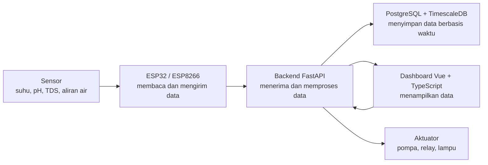
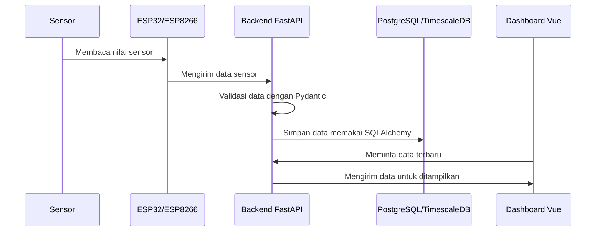
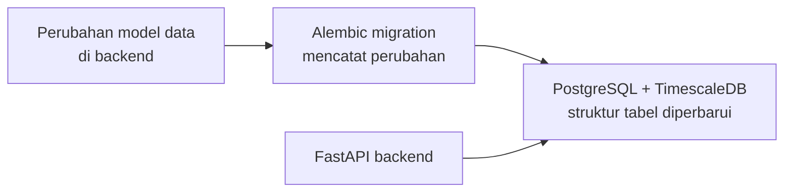

# Arsitektur Sistem

## Tujuan Bagian Ini

Bagian ini menjelaskan hubungan antara hardware, backend, database, dan dashboard. Setelah membaca bagian ini, Anda diharapkan memahami ke mana data sensor bergerak dan bagaimana perintah kontrol dikirim.

## Gambaran Besar

Smart Hydroponic memakai pola sederhana:



Sensor membaca kondisi tanaman atau lingkungan. Mikrokontroler mengirim data ke backend. Backend menyimpan data ke database dan menyediakan data untuk dashboard. Dashboard digunakan pengguna untuk memantau nilai sensor dan mengirim perintah kontrol.

Diagram ini sengaja dibuat sederhana. Detail teknisnya bisa dipelajari bertahap setelah alur besarnya terasa masuk akal.

## Alur Pengiriman Data Sensor



Alur di atas menunjukkan satu skenario umum: data bergerak dari perangkat fisik sampai muncul di dashboard.

## Alur Perubahan Struktur Database



Alembic dipakai agar perubahan tabel database tidak dilakukan secara asal. Setiap perubahan dicatat sehingga tim bisa menjalankan perubahan yang sama di laptop atau server.

## Peran Setiap Bagian

### Sensor dan Aktuator

Sensor membaca kondisi nyata, seperti suhu, kelembaban, pH, TDS, aliran air, dan tinggi air. Aktuator melakukan aksi, misalnya menyalakan pompa atau lampu melalui relay.

### ESP32 dan ESP8266

ESP32 dan ESP8266 adalah mikrokontroler. Keduanya bertugas membaca data dari sensor, menyusun data, lalu mengirimkannya ke server. Perangkat ini juga dapat menerima perintah dari server untuk mengendalikan aktuator.

### Backend API

Backend utama saat ini menggunakan Python dan FastAPI. Backend menerima data dari perangkat, menyediakan endpoint untuk dashboard, memvalidasi data dengan Pydantic, dan mengatur akses database melalui SQLAlchemy.

Endpoint penting untuk pengecekan awal:

```text
http://localhost:8000/health
```

### Database

Database menggunakan PostgreSQL dengan ekstensi TimescaleDB. TimescaleDB cocok untuk data time-series, yaitu data yang terus bertambah berdasarkan waktu, seperti nilai sensor setiap beberapa detik. Pada pruyek ini, informasi waktu disimpan ke dalam UUID yaitu UUIDv7 yang sudah mengandung informasi waktu, sehingga tidak perlu kolom terpisah untuk timestamp.

### Dashboard Web

Dashboard web menggunakan Vue. Dashboard menampilkan data sensor, membantu pemantauan kondisi sistem, dan menyediakan antarmuka untuk kontrol.

## Protokol Komunikasi

Proyek ini dapat menggunakan beberapa cara komunikasi:

- **REST API** untuk request biasa seperti login, mengambil data, atau mengubah profil nutrisi.
- **WebSocket** untuk komunikasi real-time.
- **CoAP** untuk skenario IoT ringan pada beberapa eksperimen perangkat.

Untuk saat ini, komunikasi utama menggunakan protokol Websocket.

Saat membaca kode, perhatikan folder `esp`, `backend/routes`, dan `frontend-vue/src/api` untuk melihat bagaimana komunikasi tersebut dipakai.

## Diagram


## Konfigurasi IoT

- [ ] Wiring Diagram ESP32 Node Plant Terbaru
- [ ] Wiring Diagram ESP32 Node Environment Terbaru
- [ ] Wiring Diagram ESP8266 Node Actuator Terbaru

### ESP32 Node Plant

<table>
  <thead>
    <tr>
      <th>Komponen</th>
      <th>Pin Mikrokontroler</th>
      <th>Pin Sensor</th>
    </tr>
  </thead>
  <tbody>
    <tr>
      <td rowspan="3">Sensor Soil Moisture 1</td>
      <td>3V3</td>
      <td>VCC</td>
    </tr>
    <tr>
      <td>GND</td>
      <td>GND</td>
    </tr>
    <tr>
      <td>Pin 32</td>
      <td>SIG</td>
    </tr>
    <tr>
      <td rowspan="3">Sensor Soil Moisture 2</td>
      <td>3V3</td>
      <td>VCC</td>
    </tr>
    <tr>
      <td>GND</td>
      <td>GND</td>
    </tr>
    <tr>
      <td>Pin 33</td>
      <td>SIG</td>
    </tr>
    <tr>
      <td rowspan="3">Sensor Soil Moisture 3</td>
      <td>3V3</td>
      <td>VCC</td>
    </tr>
    <tr>
      <td>GND</td>
      <td>GND</td>
    </tr>
    <tr>
      <td>Pin 34</td>
      <td>SIG</td>
    </tr>
    <tr>
      <td rowspan="3">Sensor Soil Moisture 4</td>
      <td>3V3</td>
      <td>VCC</td>
    </tr>
    <tr>
      <td>GND</td>
      <td>GND</td>
    </tr>
    <tr>
      <td>Pin 35</td>
      <td>SIG</td>
    </tr>
    <tr>
      <td rowspan="3">Sensor Soil Moisture 5</td>
      <td>3V3</td>
      <td>VCC</td>
    </tr>
    <tr>
      <td>GND</td>
      <td>GND</td>
    </tr>
    <tr>
      <td>Pin 36</td>
      <td>SIG</td>
    </tr>
    <tr>
      <td rowspan="3">Sensor Soil Moisture 6</td>
      <td>3V3</td>
      <td>VCC</td>
    </tr>
    <tr>
      <td>GND</td>
      <td>GND</td>
    </tr>
    <tr>
      <td>Pin 39</td>
      <td>SIG</td>
    </tr>
    <tr>
      <td rowspan="4">Sensor Ultrasonic (SRF05)</td>
      <td>3V3</td>
      <td>VCC</td>
    </tr>
    <tr>
      <td>GND</td>
      <td>GND</td>
    </tr>
    <tr>
      <td>Pin 18</td>
      <td>Trig</td>
    </tr>
    <tr>
      <td>Pin 19</td>
      <td>Echo</td>
    </tr>
    <tr>
      <td rowspan="3">Waterflow</td>
      <td>3V3</td>
      <td>Red Cable</td>
    </tr>
    <tr>
      <td>GND</td>
      <td>Black Cable</td>
    </tr>
    <tr>
      <td>Pin 16</td>
      <td>Input Cable</td>
    </tr>
  </tbody>
</table>

### ESP32 Node Environment

<table>
  <thead>
    <tr>
      <th>Komponen</th>
      <th>Pin Mikrokontroler</th>
      <th>Pin Sensor</th>
    </tr>
  </thead>
  <tbody>
    <tr>
      <td rowspan="3">Humidity and Temperature Sensor (DHT11) 1</td>
      <td>3V3</td>
      <td>VCC</td>
    </tr>
    <tr>
      <td>GND</td>
      <td>GND</td>
    </tr>
    <tr>
      <td>Pin 32</td>
      <td>Data Signal</td>
    </tr>
    <tr>
      <td rowspan="3">Humidity and Temperature Sensor (DHT11) 2</td>
      <td>3V3</td>
      <td>VCC</td>
    </tr>
    <tr>
      <td>GND</td>
      <td>GND</td>
    </tr>
    <tr>
      <td>Pin 33</td>
      <td>Data Signal</td>
    </tr>
    <tr>
      <td rowspan="3">TDS Meter</td>
      <td>3V3</td>
      <td>+</td>
    </tr>
    <tr>
      <td>GND</td>
      <td>-</td>
    </tr>
    <tr>
      <td>Pin 34</td>
      <td>Pin Analog</td>
    </tr>
    <tr>
      <td rowspan="3">pH Sensor</td>
      <td>3V3</td>
      <td>V+</td>
    </tr>
    <tr>
      <td>GND</td>
      <td>G</td>
    </tr>
    <tr>
      <td>Pin 35</td>
      <td>PO</td>
    </tr>
  </tbody>
</table>


### ESP8266 Node Actuator


<table>
  <thead>
    <tr>
      <th>Komponen</th>
      <th>Pin Mikrokontroler</th>
      <th>Pin Aktuator</th>
    </tr>
  </thead>
  <tbody>
    <tr>
      <td rowspan="4">Relay Pompa Air</td>
      <td>3V3</td>
      <td>VCC</td>
    </tr>
    <tr>
      <td>GND</td>
      <td>GND</td>
    </tr>
    <tr>
      <td>Pin 4 / D2</td>
      <td>IN1</td>
    </tr>
    <tr>
      <td>Pin 5 / D1</td>
      <td>IN2</td>
    </tr>
    <tr>
      <td rowspan="4">Relay Grow Light UV</td>
      <td>3V3</td>
      <td>VCC</td>
    </tr>
    <tr>
      <td>GND</td>
      <td>GND</td>
    </tr>
    <tr>
      <td>Pin 12 / D6</td>
      <td>IN1</td>
    </tr>
    <tr>
      <td>Pin 14 / D5</td>
      <td>IN2</td>
    </tr>
  </tbody>
</table>
