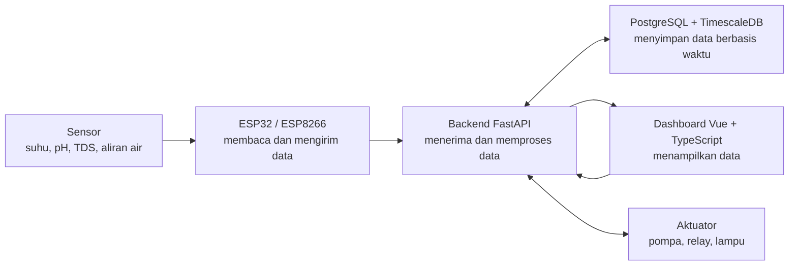

# Smart Hydroponic - Buku Panduan

Selamat datang di dokumentasi Smart Hydroponic. Dokumentasi ini dibuat untuk membantu pembaca memahami proyek secara bertahap, mulai dari konsep IoT sampai cara menjalankan backend, frontend, database, dan deployment.

Repository proyek: [IoT-Smart-Hydroponic/smart-hydroponic](https://github.com/IoT-Smart-Hydroponic/smart-hydroponic)

## Tujuan Proyek

Hidroponik adalah metode menanam tanpa tanah dengan memanfaatkan air bernutrisi. Metode ini cocok untuk kondisi lahan terbatas, tetapi tetap membutuhkan pemantauan yang rutin. Beberapa hal penting seperti suhu, kelembaban, pH, TDS, aliran air, dan tinggi air perlu diketahui agar tanaman tetap berada pada kondisi yang baik.

Smart Hydroponic menggunakan teknologi IoT untuk membantu proses tersebut. Sensor membaca kondisi lingkungan dan tanaman, mikrokontroler mengirim data ke server, lalu dashboard web menampilkan data agar pengguna dapat memantau sistem dengan lebih mudah.

## Gambaran Sistem

Sistem ini terdiri dari lima bagian besar:

1. **Sensor** membaca kondisi tanaman dan lingkungan.
2. **Mikrokontroler** seperti ESP32 atau ESP8266 mengirim data sensor ke backend.
3. **Backend API** menerima data, memproses permintaan, dan menyediakan data untuk dashboard.
4. **Database** menyimpan data sensor agar dapat dilihat kembali.
5. **Dashboard Web** menampilkan data dan menyediakan kontrol untuk aktuator.

Alur sederhananya:

## Istilah Penting

- **IoT** adalah konsep menghubungkan perangkat fisik ke jaringan agar dapat mengirim atau menerima data.
- **Sensor** adalah alat untuk membaca kondisi tertentu, misalnya suhu atau pH.
- **Aktuator** adalah alat yang melakukan aksi, misalnya pompa air atau relay.
- **REST API** adalah cara aplikasi saling bertukar data melalui endpoint HTTP.
- **WebSocket** adalah koneksi dua arah yang cocok untuk data real-time.
- **Database time-series** adalah database yang cocok untuk menyimpan data berdasarkan waktu, seperti data sensor setiap beberapa detik.

Istilah lain dijelaskan di halaman [Glossary](glossary.md).

## Komponen Hardware

Komponen yang digunakan atau didukung dalam proyek ini:

1. ESP32
2. ESP8266
3. DHT11
4. Soil moisture sensor
5. Water pump
6. Water flow sensor
7. Ultrasonic sensor
8. pH sensor
9. TDS sensor
10. Grow light LED
11. Relay module
12. Breadboard
13. Jumper wires

Penjelasan fungsi setiap komponen ada di [Hardware dan Sensor](hardware.md).

## Komponen Software

Software yang digunakan dalam proyek:

1. **Arduino IDE** untuk memprogram ESP32 dan ESP8266.
2. **Python/FastAPI** untuk backend utama.
3. **Pydantic, SQLAlchemy, dan Alembic** untuk validasi data, akses database, dan migration.
4. **Vue 3 + Vite + TypeScript** untuk dashboard web.
5. **PostgreSQL + TimescaleDB** untuk menyimpan data sensor.
6. **Docker Compose** untuk menjalankan beberapa service sekaligus.
7. **NGINX** untuk reverse proxy ketika aplikasi dipasang di server.

Penjelasan fungsi setiap teknologi ada di [Tech Stack](tech-stack.md).

## Struktur Proyek Singkat

Repository ini dibagi menjadi beberapa bagian:

- `backend/` untuk API dan logika server.
- `frontend-vue/` untuk dashboard web.
- `esp/` untuk program ESP32 dan ESP8266.
- `docs/` untuk dokumentasi pembelajaran.
- `docker-compose.*.yml` untuk menjalankan service.

Penjelasan folder yang lebih lengkap ada di [Struktur Proyek](project-structure.md).

## Cara Membaca Dokumentasi

Jika Anda baru pertama kali masuk ke proyek ini, gunakan urutan berikut:

1. [Cara Membaca Dokumentasi Ini](how-to-read.md)
2. [Memulai Sistem Smart Hydroponic](getting-started.md)
3. [Arsitektur Sistem](architecture.md)
4. [Tech Stack](tech-stack.md)
5. [Struktur Proyek](project-structure.md)
6. [Hardware dan Sensor](hardware.md)
7. [Pengembangan Backend](backend/development.md)
8. [Deploy Frontend](frontend/deploy.md)
9. [Troubleshooting](troubleshooting.md)

## Architecture Diagram

