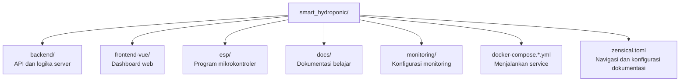
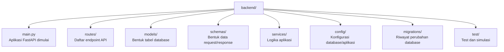
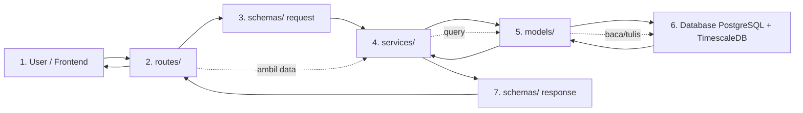
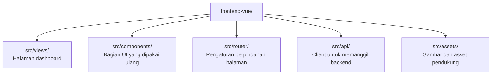
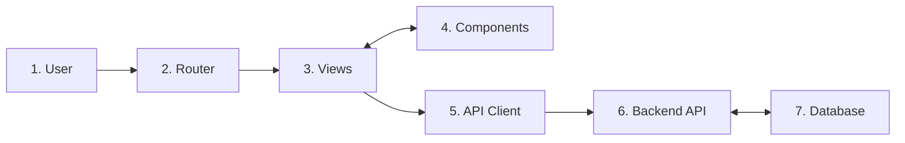

# Struktur Proyek

## Tujuan Bagian Ini

Bagian ini menjelaskan fungsi folder utama dalam repository. Tujuannya bukan menghafal semua file, tetapi tahu harus membuka folder mana saat ingin mencari sesuatu.

## Peta Folder Utama



Gunakan diagram ini sebagai peta awal. Kalau ingin mengubah tampilan dashboard, buka `frontend-vue`. Kalau ingin mengubah API, buka `backend`.

## Folder `backend/`

Folder ini berisi backend Python/FastAPI.



Penjelasan singkat:

| Folder/File | Fungsi |
| --- | --- |
| `main.py` | Titik awal aplikasi FastAPI. |
| `routes/` | Tempat endpoint API didefinisikan. |
| `models/` | Tempat struktur tabel database direpresentasikan dalam kode. |
| `schemas/` | Tempat bentuk data request dan response didefinisikan. |
| `services/` | Tempat logika aplikasi yang lebih panjang atau berulang. |
| `config/` | Tempat konfigurasi seperti koneksi database. |
| `migrations/` | Tempat Alembic menyimpan perubahan struktur database. |
| `test/` | Tempat test dan simulasi perangkat. |

Alur kerja:



## Folder `frontend-vue/`

Folder ini berisi dashboard Vue.



Penjelasan singkat:

| Folder/File | Fungsi |
| --- | --- |
| `src/views/` | Halaman utama seperti dashboard, login, atau analytics. |
| `src/components/` | Komponen tampilan seperti sidebar, topbar, footer, atau modal. |
| `src/router/` | Mengatur URL dan halaman yang ditampilkan. |
| `src/api/` | Kode generated untuk memanggil backend API. |
| `src/assets/` | Gambar, style, dan asset tampilan. |

Alur kerja:



## Folder `esp/`

Folder ini berisi program untuk ESP32 dan ESP8266. Program di folder ini adalah firmware, yaitu kode yang dijalankan pada mikrokontroler.

Beberapa subfolder memisahkan eksperimen atau protokol komunikasi, misalnya WebSocket dan CoAP.

## Folder `docs/`

Folder ini berisi dokumentasi yang sedang Anda baca. File `zensical.toml` mengatur urutan halaman dan konfigurasi situs agar dokumentasi dapat dibaca seperti buku panduan.

## File Docker Compose

File seperti `docker-compose.dev.yml` dan `docker-compose.prod.yml` membantu menjalankan beberapa service sekaligus.

Contohnya:

```text
database + backend + frontend
```

Dengan Docker Compose, Anda tidak perlu menjalankan semuanya satu per satu secara manual.

## Cara Agar Tidak Overwhelm

Saat baru belajar, jangan buka semua folder sekaligus. Mulai dari kebutuhan (hal yang membuat kamu penasaran) lalu buka folder yang relevan. Misalnya:

1. Ingin tahu alur sistem: buka `docs/`.
2. Ingin menjalankan aplikasi: buka `docker-compose.dev.yml` dan [Memulai Sistem Smart Hydroponic](getting-started.md).
3. Ingin memahami API: buka `backend`. Baca `main.py` untuk melihat bagaimana aplikasi dimulai, lalu buka `routes/` untuk melihat endpoint API. Buka `schemas/` untuk melihat bentuk data yang dikirim dan diterima. Setiap file saling terhubung satu sama lain, jadi jangan khawatir kalau belum langsung paham. Baca perlahan dan coba ikuti alur data dari user ke database dan kembali lagi.
4. Ingin memahami tampilan: buka `frontend-vue/src/views/` atau `frontend-vue/src/components/`.
5. Ingin melihat program perangkat: buka `esp/`.
