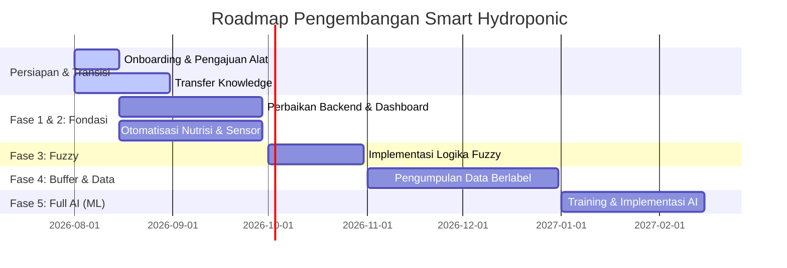

# Roadmap Pengembangan Smart Hydroponic

Dokumen ini berisi rencana jangka panjang dan *milestone* pengembangan proyek **Smart Hydroponic**. Tujuannya adalah untuk memberikan panduan dan arah yang jelas bagi pengurus maupun kontributor baru yang akan meneruskan proyek ini. 

*Penting: Pengembangan AI sangat bergantung pada stabilitas hardware dan data. Prinsip utama roadmap ini adalah **Stabilisasi Sistem sebelum Implementasi AI**.*

---

## 📅 Timeline Visual (Gantt Chart)

Berikut adalah estimasi visual dari rencana pengembangan yang dimulai dari transisi kepengurusan baru pada bulan Agustus 2026.

---

## 🎯 Detail Milestone

### Tahap Persiapan (Agustus 2026)
Fokus pada pengenalan sistem.

- [ ] Pengajuan dan pembelian alat/komponen baru.
- [ ] *Transfer Knowledge* arsitektur sistem dari pengurus lama.
- [ ] Memahami cara membaca dokumentasi dan *codebase*.

### Fase 1 & 2: Fondasi Sistem & Hardware (Pertengahan Agustus - September 2026)
Memastikan perangkat keras dan perangkat lunak dasar berjalan tanpa hambatan.

- [ ] **Backend & Dashboard:** Memperbaiki sistem *monitoring* yang ada agar stabil tanpa ada *lag* atau data yang hilang.
- [ ] **Hardware:** Merapikan perkabelan (*cable management*) dan diperkelompokkan menjadi sebuah modul-modul agar aman dari air/karat, serta bagus dilihat.
- [ ] **Sensor:** Perbaikan dan kalibrasi sensor (pH, TDS).
- [ ] Menjalankan sistem otomatisasi nutrisi tingkat dasar.

**Fitur-fitur tambahan:**

- [ ] Tampilan menu untuk menambahkan profil nutrisi untuk masing-masing tanaman. (Bisa melakukan riset secara mandiri dan mendalam mengenai nutrisi tanaman, rincian kebutuhan nutrisi tiap 7 hari, 14 hari, dsb).
- [ ] Fitur log untuk merekam kondisi yang terjadi pada sistem hidroponik.
- [ ] Fitur notifikasi terkait kondisi sistem.
- [ ] Mengubah tabel database agar menyimpan data historis per jenis tanaman.
- [ ] Mengubah alur dashboard. Saat ini: Tampilan utama -> Menu lainnya; Perubahan: Memilih jenis tanaman yang mau dipantau -> Tampilan Utama -> Menu lainnya.
- [ ] MCP (Model Context Protocol) untuk sistem hidroponik + Chatbot.
- [ ] Deskripsi chart pada web menggunakan deskripsi analisis dari LLM.

### Fase 3: Implementasi Logika Fuzzy (Oktober 2026)
Menerapkan kecerdasan berbasis *rule* (aturan baku) tanpa harus mengandalkan *Machine Learning*.

- [ ] Mengimplementasikan logika *Fuzzy* untuk otomatisasi nutrisi berdasarkan input beberapa sensor sekaligus.
- [ ] **Fase Stabilisasi:** Sistem dibiarkan berjalan dengan *Fuzzy* untuk diamati kestabilannya.

### Fase 4: Buffer Pengumpulan Data (November - Desember 2026)
Pengumpulan data dilakukan ketika sistem dapat dipastikan stabil.

- [ ] Membiarkan sistem hidroponik berjalan secara stabil hingga melewati 1-2 siklus panen (kurang lebih 60 hari).
- [ ] Sistem terus mencatat data sensor ke database.
- [ ] Pengurus melakukan pendataan label secara manual (misal: mencatat berat basah, tinggi tanaman, jumlah daun) untuk dikorelasikan dengan data sensor.

### Fase 5: Implementasi Full AI / Machine Learning (Mulai Januari 2027)
Membuat sistem yang mampu memprediksi dan belajar dari histori panen sebelumnya.

- [ ] Mengekstrak dan membersihkan *dataset* yang terkumpul di Fase 4.
- [ ] Melakukan *training* model Machine Learning (contoh: regresi untuk memprediksi waktu panen optimal atau klasifikasi kebutuhan nutrisi).
- [ ] Mengintegrasikan model AI ke dalam *backend* Smart Hydroponic.

---

## 📝 Hubungan dengan GitHub Projects
Dokumen ini bersifat sebagai **Big Picture (Panduan Utama)**. Untuk melacak progres harian/mingguan (siapa yang mengerjakan apa dan batas waktunya), silakan mengacu ke papan Kanban di **GitHub Projects**. Setiap sub-poin di atas harus dipecah menjadi *Issue* atau tugas spesifik di GitHub.
