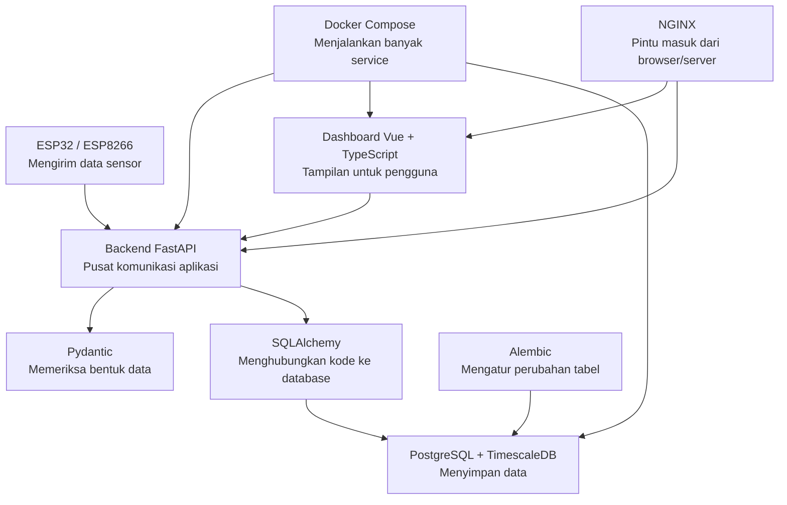
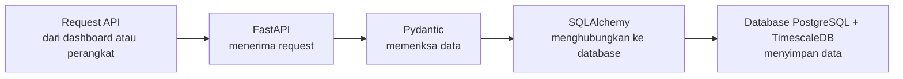
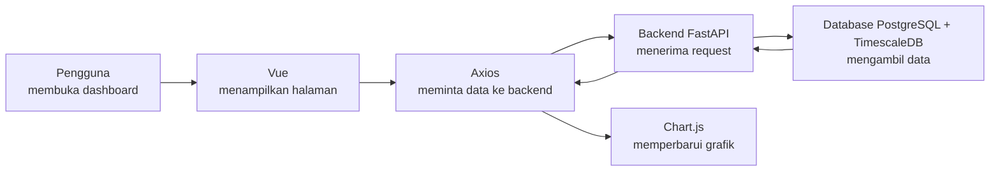

# Tech Stack

## Tujuan Bagian Ini

Bagian ini menjelaskan teknologi yang dipakai dalam Smart Hydroponic dengan bahasa sederhana. kamu tidak harus langsung mahir memakai semuanya. Tujuan awalnya adalah mengenali peran setiap alat agar saat melihat kode atau dokumentasi lain, istilahnya tidak terasa asing.

Bayangkan proyek ini seperti sistem kerja tim. Setiap teknologi punya tugas sendiri.

## Gambaran Peran Teknologi



Diagram di atas tidak perlu dihafal, karena kamu akan paham seiring belajar dan praktek. Gunakan sebagai peta saat kamu bertanya: “bagian ini tugasnya apa?”

## Backend

Backend adalah bagian aplikasi yang berjalan di server. Dalam proyek ini, backend menerima data dari perangkat IoT, menyediakan data untuk dashboard, dan mengatur hubungan ke database.

| Teknologi | Dipakai Untuk Apa? | Kenapa Penting? |
| --- | --- | --- |
| Python | Bahasa utama backend | Sintaksnya relatif mudah dibaca dan banyak dipakai untuk API, data, dan otomasi. |
| FastAPI | Membuat endpoint API | Membantu membuat jalur komunikasi seperti `/health`, login, atau data hidroponik. |
| Pydantic | Validasi data | Membantu memastikan data yang masuk bentuknya benar sebelum diproses. |
| SQLAlchemy | Akses database dari Python | Membuat kode Python bisa membaca dan menulis data ke PostgreSQL. |
| Alembic | Migration database | Mencatat perubahan struktur tabel agar database bisa diperbarui secara rapi. |

Contoh hubungan sederhananya:



## Frontend

Frontend adalah bagian aplikasi yang dibuka pengguna melalui browser. Dalam proyek ini, frontend berbentuk dashboard.

| Teknologi | Dipakai Untuk Apa? | Kenapa Penting? |
| --- | --- | --- |
| Vue | Membuat tampilan dashboard | Memudahkan pembuatan halaman, komponen, dan interaksi pengguna. |
| TypeScript | Bahasa untuk kode frontend yang mendukung tipe data | Membantu mengurangi kesalahan saat data yang dipakai tidak sesuai bentuknya. |
| Vite | Development server dan build tool | Membuat proses menjalankan dan membangun frontend lebih cepat. |
| Axios | Mengirim request API | Dipakai frontend untuk mengambil atau mengirim data ke backend. |
| Chart.js | Membuat grafik | Cocok untuk menampilkan data sensor dalam bentuk visual. |

Contoh hubungan sederhananya:



## Database

Database menyimpan data agar tidak hilang saat aplikasi dimatikan.

| Teknologi | Dipakai Untuk Apa? | Kenapa Penting? |
| --- | --- | --- |
| PostgreSQL | Menyimpan data utama | Cocok untuk data terstruktur seperti pengguna, profil nutrisi, dan log. |
| TimescaleDB | Menyimpan data berbasis waktu | Cocok untuk data sensor yang terus masuk dari waktu ke waktu. |

Karena ada unsur waktu, TimescaleDB membantu database bekerja lebih nyaman untuk data seperti ini.

## Infrastruktur

Infrastruktur adalah alat yang membantu aplikasi berjalan di komputer atau server.

| Teknologi | Dipakai Untuk Apa? | Kenapa Penting? |
| --- | --- | --- |
| Docker | Menjalankan aplikasi dalam container | Membantu aplikasi berjalan lebih konsisten di laptop dan server. |
| Docker Compose | Menjalankan banyak container sekaligus | Database, backend, dan frontend bisa dijalankan dengan satu command. |
| NGINX | Reverse proxy dan web server | Membantu mengatur akses dari browser ke frontend atau backend. |

Contoh saat memakai Docker Compose:

```text
docker compose up -> database hidup -> backend hidup -> frontend hidup
```

## Cara Memahami

Semua istilah tidak perlu dihafal sekaligus, karena akan hafal dengan sendirinya seiring belajar dan pengembangan (praktek). Tapi kita bisa mulai dari pertanyaan kecil:

1. “Data sensor masuk lewat mana?”
2. “Di mana data disimpan?”
3. “Bagaimana dashboard mengambil data?”
4. “Kalau tabel berubah, siapa yang mengatur?”
5. “Kalau aplikasi dipasang di server, siapa yang menerima request browser?”

Jika pertanyaan itu bisa kamu jawab, berarti kamu sudah mulai memahami sistemnya.
